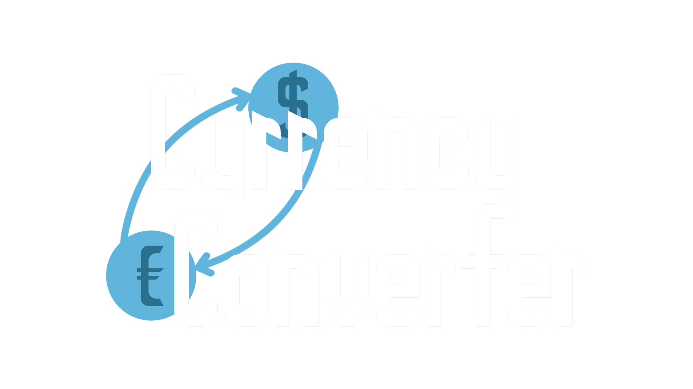

<br />
<div align="center">
  <a href="https://github.com/zidanesalim/CurrencyConverter">
    
  </a>

  <h3 align="center">Currency Converter</h3>
</div>

## About The Project

[![Product Screenshot][product-screenshot]](https://github.com/zidanesalim/CurrencyConverter)

A minimal currency converter that lets you quickly convert between major currencies using live exchange rates — no API key required.


## Built With

* 
* 
* 
* 

## Getting Started

### Prerequisites

* npm
  ```sh
  npm install npm@latest -g
  ```

### Installation

1. Clone the repo
   ```sh
   git clone https://github.com/zidanesalim/CurrencyConverter.git
   ```
2. Install dependencies
   ```sh
   npm install
   ```
3. Start the dev server
   ```sh
   npm run dev
   ```

No API key needed — the app uses [Frankfurter](https://www.frankfurter.app/), a free and open exchange rate API.

## Usage

1. Enter an amount in the top field
2. Select the source currency
3. Select the target currency
4. Click **Convert**

## Roadmap

- [x] Live currency conversion
- [x] Support for USD, EUR, GBP
- [ ] Add support for more currencies
- [ ] Add historical rates (convert with the rates of a specific date)
