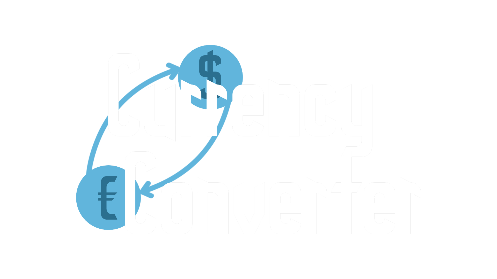

<br />
<div align="center">
  <a href="https://github.com/zidanesalim/CurrencyConverter">
    
  </a>
  <h3 align="center">Currency Converter</h3>
</div>

## About The Project


Currency converter that lets you quickly convert between ~190 currencies using live exchange rates, plus a **DevEx calculator** that turns Roblox Robux into real money at the Developer Exchange payout rates.

## Built With

* 
* 
* 
* 
* 

## Getting Started

### Prerequisites

* npm
  ```sh
  npm install npm@latest -g
  ```

### Installation

1. Clone the repo
   ```sh
   git clone https://github.com/zidanesalim/CurrencyConverter.git
   ```
2. Install dependencies
   ```sh
   npm install
   ```
3. Add your exchange rate API key (optional)
   ```sh
   cp .env.example .env
   # then set VITE_CURRENCY_API_KEY
   ```
4. Start the dev server
   ```sh
   npm run dev
   ```

### Exchange rates

The app reads rates from [CurrencyAPI](https://currencyapi.com/) (~190 currencies, including crypto) when
`VITE_CURRENCY_API_KEY` is set, and falls back to the keyless [Frankfurter](https://www.frankfurter.app/)
API (~30 currencies) otherwise — so it still runs with no configuration at all.

Rates are fetched once against USD and cached for an hour, and every pair is derived from that table as a
cross-rate. One request therefore covers the whole session, which keeps the app inside CurrencyAPI's
300 requests/month free tier.

> [!WARNING]
> This is a browser-only app, so any `VITE_`-prefixed variable is inlined into the production bundle and
> is readable by anyone who visits the site. Restrict the key by domain in the CurrencyAPI dashboard, and
> use a server-side proxy if it needs to stay secret.

## Usage

### Currency conversion

1. Enter an amount in the top field
2. Select the source currency
3. Select the target currency
4. Click **Convert**

### DevEx calculator

Converts Roblox Robux to a cash payout at the Developer Exchange rates:

| Tier | Rate |
| --- | --- |
| Standard | $0.38 per 100 Robux |
| 18+ (US) | $0.54 per 100 Robux |

1. Enter a Robux amount
2. Pick your DevEx tier
3. Choose the currency to be paid out in — the USD payout is converted at the live rate
4. Use the swap button to go the other way and work out how much Robux a target payout needs

Amounts below Roblox's 30,000 Robux cash-out minimum are flagged.

## Roadmap

- [x] Live currency conversion
- [x] Support for USD, EUR, GBP
- [x] Support for more currencies
- [x] Roblox DevEx calculator
- [ ] Historical rates (convert with the rates of a specific date)
